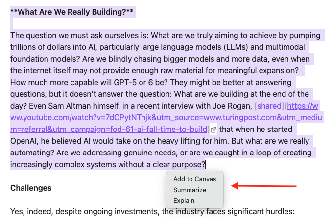
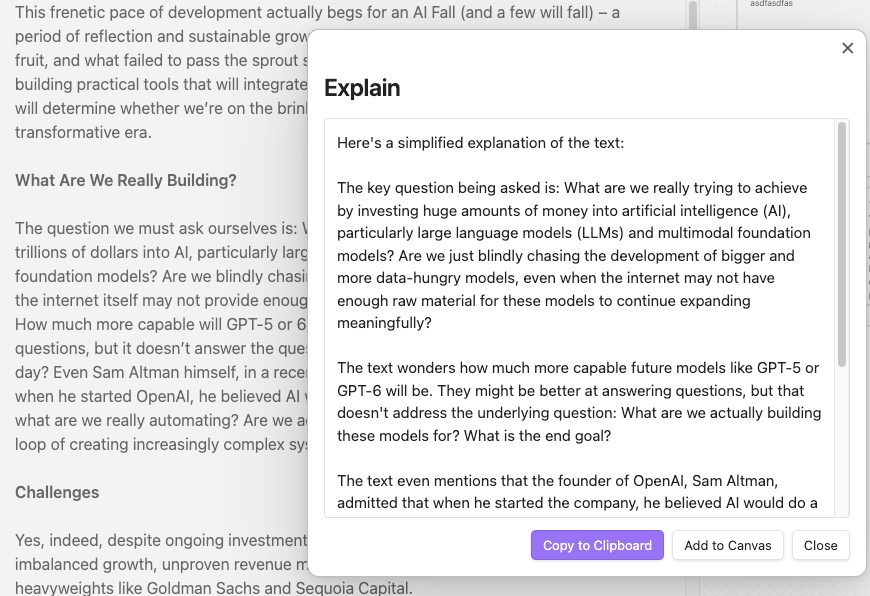
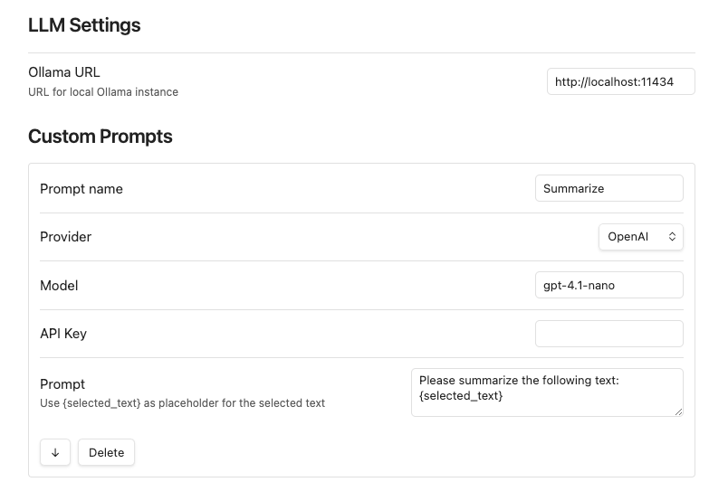

# Obsidian Plugin Selection Menu 
The plugin adds custom menu that is applied for selected text.
Menu is triggered when text in a note is selected and hotkey is pressed.

Plugin helps for workflow...

## Selection Menu has default actions
|Action|Description|
|---|---|
|Add to canvas|Add selected text to canvas. If there is no canvas with the same file name as a note, then new canvas will be created. Selected text is added to a group `Quotes`.|
|Summary, Explain| Custom LLM prompt. Selected text is passed to custom prompt. LLM returns result is modal window.|

Selection menu:


Prompt response:



## Settings
### LLM Settings
You can add up 10 prompts in Selection Menu and change their order in the menu.
Supported LLM providers: OpenAI, Anthropic, Ollama.



# Installation
```bash
cd ~/my_obsidian_vaul/.obsidian/plugins
git pull https://github.com/alena-m/obsidian-selection-menu.git
```
Enable plugin in Obsidian Settings => Comminity plugins

### To build
```bash
cd ~/my_obsidian_vaul/.obsidian/plugins/obsidian-selection-menu
npm install
npx esbuild main.ts --bundle --external:obsidian --format=cjs --outfile=main.js --platform=node
```
